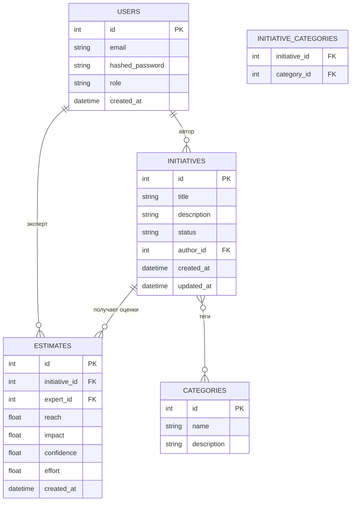

# Схема базы данных

## Описание таблиц

### USERS — пользователи сервиса

| Поле | Тип | Описание |
|------|-----|----------|
| id | integer | первичный ключ |
| email | string | уникальный, не null |
| hashed_password | string | bcrypt-хеш пароля |
| role | string | `admin`, `expert`, `viewer` |
| created_at | datetime | дата регистрации |

### INITIATIVES — IT-инициативы

| Поле | Тип | Описание |
|------|-----|----------|
| id | integer | первичный ключ |
| title | string | название, не null |
| description | string | описание |
| status | string | `draft`, `proposed`, `approved`, `in_progress`, `done`, `rejected` |
| author_id | integer | FK → USERS.id |
| created_at | datetime | дата создания |
| updated_at | datetime | дата последнего изменения |

### ESTIMATES — оценки экспертов по RICE

| Поле | Тип | Описание |
|------|-----|----------|
| id | integer | первичный ключ |
| initiative_id | integer | FK → INITIATIVES.id |
| expert_id | integer | FK → USERS.id |
| reach | float | охват (0–100) |
| impact | float | влияние (0–3) |
| confidence | float | уверенность (0–100) |
| effort | float | трудозатраты в человеко-месяцах |
| created_at | datetime | дата оценки |

### CATEGORIES — категории/теги

| Поле | Тип | Описание |
|------|-----|----------|
| id | integer | первичный ключ |
| name | string | уникальное название |
| description | string | описание категории |

### INITIATIVE_CATEGORIES — связь many-to-many

| Поле | Тип | Описание |
|------|-----|----------|
| initiative_id | integer | FK → INITIATIVES.id |
| category_id | integer | FK → CATEGORIES.id |

## Инварианты

- `USERS.email` — уникален
- `ESTIMATES(initiative_id, expert_id)` — уникальная пара: один эксперт одна оценка на инициативу
- `CATEGORIES.name` — уникально
- При удалении пользователя — каскадное удаление его инициатив и оценок
- При удалении инициативы — каскадное удаление её оценок и связей с категориями
